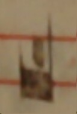
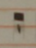

# OMR_Portuguese_Sources

Resources for the Optical Music Recognition (OMR) for Iberian Aquitanian and Iberian square notations as found in manuscripts:
- [Salamanca Missal, E-SAu Ms. 2637 (ACm)](https://pemdatabase.eu/source/48357) in _Iberian Aquitanian notation_
- [P-BRs Ms. 034](https://pemdatabase.eu/source/47612) in _Iberian square notation_

The resources for each of the four steps of an OMR workflow can be found in each in the following folders:
- **Document Analysis** in [`resources/1_document_analysis/`](https://github.com/ECHOES-from-the-Past/OMR_Portuguese_Sources/tree/main/resources/1_document_analysis)
- **Music Symbol Classification** in [`resources/2_music_symbol_classification/`](https://github.com/ECHOES-from-the-Past/OMR_Portuguese_Sources/tree/main/resources/2_music_symbol_classification)
- **Music Reconstruction** in the folder for processing of the text in [`resources/3_text_alignment/`](https://github.com/ECHOES-from-the-Past/OMR_Portuguese_Sources/tree/main/resources/3_text_alignment)
- **Music Encoding** in [`resources/4_mei_encoding/`](https://github.com/ECHOES-from-the-Past/OMR_Portuguese_Sources/tree/main/resources/4_mei_encoding)

## The Case of Iberian Aquitanian and Square notations

### Iberian Square Notation
Iberian square notation has some differences when compared to regular??? square notation:
1. Some extra symbols. For example, the lengueta, which implies a repeated note and looks like:

     
     
2. Some symbols that are used with a different functionality. For example, the following symbol that looks like a plica but it is not representing a liquescent, but a repeated note.

   

### Iberian Aquitanian Notation
Aquitanian notation is characterized by the use of a single music reference line and no clefs.
