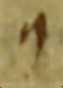
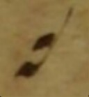
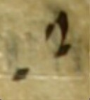
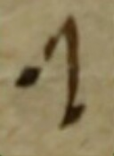

| imagePath | imageBinary | name | folio | description | classification | width | mei | dob | project |
| --------- | ----------- | ---- | ----- | ----------- | -------------- | ----- | --- | --- | ------- | 
| https://pemdatabase.eu/iipsrv/iipsrv.fcgi?IIIF=images/1d335927-f461-4bdb-a6e5-069a24a9d3f1/RQKyrNTU8790.tiff/1478,2286,33,55/128,/0/default.jpg |  | Custos | 18v | Tolle puerum, 2nd line, end | custos | 1 | `<custos/>` | |  E-SAu Ms. 2637 (ACm) |
| https://pemdatabase.eu/iipsrv/iipsrv.fcgi?IIIF=images/1d335927-f461-4bdb-a6e5-069a24a9d3f1/V9ZD2CnI8759.tiff/1900,545,31,38/128,/0/default.jpg |  | Punctum | 3r | Dominus dabit, 1st line, benignitaTEM | neume.punctum | 1 | `<neume>` &nbsp;&nbsp;&nbsp;&nbsp;`<nc/>` `</neume>` | | E-SAu Ms. 2637 (ACm) |
| https://pemdatabase.eu/iipsrv/iipsrv.fcgi?IIIF=images/1d335927-f461-4bdb-a6e5-069a24a9d3f1/s0N4NSFQ8805.tiff/1371,2130,50,37/128,/0/default.jpg |  | Inclinatum | 26r | Illumina, 1st line, TUum | neume.inclinatum | 1 | `<neume>` &nbsp;&nbsp;&nbsp;&nbsp;`<nc tilt="se"/>` `</neume>` |  | E-SAu Ms. 2637 (ACm) |
| https://github.com/ECHOES-from-the-Past/GABCtoMEI/blob/main/images/punctum_AQ.jpg | ? | Virga | | | neume.virga | 1 | `<neume>` &nbsp;&nbsp;&nbsp;&nbsp;`<nc tilt="s"/>` `</neume>` | | |
| https://pemdatabase.eu/iipsrv/iipsrv.fcgi?IIIF=images/1d335927-f461-4bdb-a6e5-069a24a9d3f1/V9ZD2CnI8759.tiff/2048,576,22,50/128,/0/default.jpg |  | Reverse virga | 3r | Dominus dabit, 1st line, teRRA | neume.reversevirga | 1 | `<neume>` &nbsp;&nbsp;&nbsp;&nbsp;`<nc tilt="ne"/>` `</neume>` | | E-SAu Ms. 2637 (ACm) |
| https://pemdatabase.eu/iipsrv/iipsrv.fcgi?IIIF=images/1d335927-f461-4bdb-a6e5-069a24a9d3f1/V9ZD2CnI8759.tiff/1936,541,37,52/128,/0/default.jpg |  | Cephalicus stem left | 3r | Dominus dabit, 1st line, ET | neume.cephalicus.left | 1 | `<neume>` &nbsp;&nbsp;&nbsp;&nbsp;`<nc curve="c" tilt="ne" type="cephalicus">` &nbsp;&nbsp;&nbsp;&nbsp;&nbsp;&nbsp;&nbsp;&nbsp;`<liquescent/>` &nbsp;&nbsp;&nbsp;&nbsp;`</nc>` `</neume>` | | E-SAu Ms. 2637 (ACm) |
| https://github.com/ECHOES-from-the-Past/GABCtoMEI/blob/main/images/punctum_AQ.jpg | ? | Cephalicus stem right | | | neume.cephalicus.right | 1 | `<neume>` &nbsp;&nbsp;&nbsp;&nbsp;`<nc curve="c" tilt="s" type="cephalicus">` &nbsp;&nbsp;&nbsp;&nbsp;&nbsp;&nbsp;&nbsp;&nbsp;`<liquescent/>` &nbsp;&nbsp;&nbsp;&nbsp;`</nc>` `</neume>` | |  |
| https://pemdatabase.eu/iipsrv/iipsrv.fcgi?IIIF=images/1d335927-f461-4bdb-a6e5-069a24a9d3f1/oI017Xju8794.tiff/1847,720,60,65/128,/0/default.jpg |  | Epiphonus | 20v | Vidimus stellam, 1st line, STELlam | neume.epiphonus | 1 | `<neume>` &nbsp;&nbsp;&nbsp;&nbsp;`<nc curve="a" type="epiphonus">` &nbsp;&nbsp;&nbsp;&nbsp;&nbsp;&nbsp;&nbsp;&nbsp;`<liquescent/>` &nbsp;&nbsp;&nbsp;&nbsp;`</nc>` `</neume>` | | E-SAu Ms. 2637 (ACm) |
| https://github.com/ECHOES-from-the-Past/GABCtoMEI/blob/main/images/epiphonus_AQ.jpg | TO DO | Oriscus | 26r | Illumina, 3rd line, confunDAR | neume.oriscus | 1 | `<neume>` &nbsp;&nbsp;&nbsp;&nbsp;`<nc>` &nbsp;&nbsp;&nbsp;&nbsp;&nbsp;&nbsp;&nbsp;&nbsp;`<oriscus/>` &nbsp;&nbsp;&nbsp;&nbsp;`</nc>` `</neume>` | | E-SAu Ms. 2637 (ACm) |
| https://github.com/ECHOES-from-the-Past/GABCtoMEI/blob/main/images/epiphonus_AQ.jpg | TO DO | Quilisma | 18v | Tolle puerum, 1st line, TErram | neume.quilisma | 1 | `<neume>` &nbsp;&nbsp;&nbsp;&nbsp;`<nc>` &nbsp;&nbsp;&nbsp;&nbsp;&nbsp;&nbsp;&nbsp;&nbsp;`<quilisma/>` &nbsp;&nbsp;&nbsp;&nbsp;`</nc>` `</neume>` | | E-SAu Ms. 2637 (ACm) |
| https://github.com/ECHOES-from-the-Past/GABCtoMEI/blob/main/images/epiphonus_AQ.jpg | SQUARE | Plica down | | | neume.plica.down | 1 | `<neume type="twolegsdown">` &nbsp;&nbsp;&nbsp;&nbsp;`<nc/>` &nbsp;&nbsp;&nbsp;&nbsp;`<nc intm="0S"/>` `</neume>` | | |
| https://github.com/ECHOES-from-the-Past/GABCtoMEI/blob/main/images/epiphonus_AQ.jpg | SQUARE | Plica up | | | neume.plica.up | 1 | `<neume type="twolegsup">` &nbsp;&nbsp;&nbsp;&nbsp;`<nc/>` &nbsp;&nbsp;&nbsp;&nbsp;`<nc intm="0S"/>` `</neume>` | | |
| https://github.com/ECHOES-from-the-Past/GABCtoMEI/blob/main/images/epiphonus_AQ.jpg | SQUARE | Lengueta down | | | neume.lengueta.down | 1 | `<neume type="lenguetadown">` &nbsp;&nbsp;&nbsp;&nbsp;`<nc/>` &nbsp;&nbsp;&nbsp;&nbsp;`<nc intm="0S"/>` `</neume>` | | |
| https://github.com/ECHOES-from-the-Past/GABCtoMEI/blob/main/images/epiphonus_AQ.jpg | SQUARE | Lengueta up | | | neume.lengueta.up | 1 | `<neume type="lenguetaup">` &nbsp;&nbsp;&nbsp;&nbsp;`<nc/>` &nbsp;&nbsp;&nbsp;&nbsp;`<nc intm="0S"/>` `</neume>` | | |
| https://pemdatabase.eu/iipsrv/iipsrv.fcgi?IIIF=images/1d335927-f461-4bdb-a6e5-069a24a9d3f1/h_zRaSsE8826.tiff/567,2231,45,56/128,/0/default.jpg |  | Torculus11 | 37r | Scapulis, 2nd line, scuTO | neume.torculus11 | [1, 1, 1] | `<neume type="lenguetaup">` &nbsp;&nbsp;&nbsp;&nbsp;`<nc/>` &nbsp;&nbsp;&nbsp;&nbsp;`<nc intm="1S"/>` &nbsp;&nbsp;&nbsp;&nbsp;`<nc intm="-1S"/>` `</neume>` | | E-SAu Ms. 2637 (ACm) |
| https://pemdatabase.eu/iipsrv/iipsrv.fcgi?IIIF=images/1d335927-f461-4bdb-a6e5-069a24a9d3f1/V9ZD2CnI8759.tiff/1349,534,66,73/128,/0/default.jpg |   | Torculus21 | 3r | Dominus dabit, 1st line, doMInus | neume.torculus21 | [1, 1, 1] | `<neume type="lenguetaup">` &nbsp;&nbsp;&nbsp;&nbsp;`<nc/>` &nbsp;&nbsp;&nbsp;&nbsp;`<nc intm="2S"/>` &nbsp;&nbsp;&nbsp;&nbsp;`<nc intm="-1S"/>` `</neume>` | | E-SAu Ms. 2637 (ACm) |
| https://pemdatabase.eu/iipsrv/iipsrv.fcgi?IIIF=images/1d335927-f461-4bdb-a6e5-069a24a9d3f1/jyc11xgr8762.tiff/773,2062,55,75/128,/0/default.jpg |   | Torculus12 | 4v | Jerusalem surge, 1st line, JErusalem | neume.torculus12 | [1, 1, 1] | `<neume type="lenguetaup">` &nbsp;&nbsp;&nbsp;&nbsp;`<nc/>` &nbsp;&nbsp;&nbsp;&nbsp;`<nc intm="1S"/>` &nbsp;&nbsp;&nbsp;&nbsp;`<nc intm="-2S"/>` `</neume>` | | E-SAu Ms. 2637 (ACm) |
| https://pemdatabase.eu/iipsrv/iipsrv.fcgi?IIIF=images/1d335927-f461-4bdb-a6e5-069a24a9d3f1/jjx1scZx8779.tiff/971,2032,60,81/128,/0/default.jpg |   | Torculus23 | 13r | In splendoribus, 1st line, liduFErum | neume.torculus23 | [1, 1, 1] | `<neume type="lenguetaup">` &nbsp;&nbsp;&nbsp;&nbsp;`<nc/>` &nbsp;&nbsp;&nbsp;&nbsp;`<nc intm="2S"/>` &nbsp;&nbsp;&nbsp;&nbsp;`<nc intm="-3S"/>` `</neume>` | | E-SAu Ms. 2637 (ACm) |
| https://pemdatabase.eu/iipsrv/iipsrv.fcgi?IIIF=images/1d335927-f461-4bdb-a6e5-069a24a9d3f1/RQKyrNTU8790.tiff/670,2095,28,57/128,/0/default.jpg |   | WHAT IS THIS??? | 18v | Tolle puerum, 1st line, TOLle | neume.... | 1 | ... | | E-SAu Ms. 2637 (ACm) |
| https://pemdatabase.eu/iipsrv/iipsrv.fcgi?IIIF=images/1d335927-f461-4bdb-a6e5-069a24a9d3f1/_1Euldt68848.tiff/669,760,52,53/128,/0/default.jpg |   | WHAT IS THIS??? | 47v | Narrabo, 2nd line, exULtabo | neume.... | 1 | ... | | E-SAu Ms. 2637 (ACm) |
