# Aquitanian OMR Table for MEI Encoding Job in Rodan

This is the MEI Mapping table that contains the information needed for Rodan's MEI Encoding job to map the classes of the symbols used in the Interactive/Non-Interactive Classifier (e.g., `neume.punctum`, `neume.inclinatum`, and `custos`) into their corresponding MEI encoding. These are all the "atomic" symbols that appear in E-SAu Ms. 2637 (ACm), also known as the Salamanca Missal (https://pemdatabase.eu/source/48357).

| imagePath | imageBinary | name | folio | description | classification | width | mei | dob | project |
| --------- | ----------- | ---- | ----- | ----------- | -------------- | ----- | --- | --- | ------- | 
| https://pemdatabase.eu/iipsrv/iipsrv.fcgi?IIIF=images/1d335927-f461-4bdb-a6e5-069a24a9d3f1/RQKyrNTU8790.tiff/1478,2286,33,55/128,/0/default.jpg | 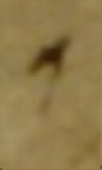 | Custos | 18v | Tolle puerum, 2nd line, end | custos | 1 | `<custos/>` | |  E-SAu Ms. 2637 (ACm) |
| https://pemdatabase.eu/iipsrv/iipsrv.fcgi?IIIF=images/1d335927-f461-4bdb-a6e5-069a24a9d3f1/V9ZD2CnI8759.tiff/1900,545,31,38/128,/0/default.jpg | 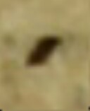 | Punctum | 3r | Dominus dabit, 1st line, benignitaTEM | neume.punctum | 1 | `<neume>` &nbsp;&nbsp;&nbsp;&nbsp;`<nc/>` `</neume>` | | E-SAu Ms. 2637 (ACm) |
| https://pemdatabase.eu/iipsrv/iipsrv.fcgi?IIIF=images/1d335927-f461-4bdb-a6e5-069a24a9d3f1/s0N4NSFQ8805.tiff/1371,2130,50,37/128,/0/default.jpg | 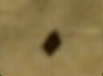 | Rhombus | 26r | Illumina, 1st line, TUum | neume.rhombus | 1 | `<neume>` &nbsp;&nbsp;&nbsp;&nbsp;`<nc tilt="se"/>` `</neume>` |  | E-SAu Ms. 2637 (ACm) |
| https://pemdatabase.eu/iipsrv/iipsrv.fcgi?IIIF=images/1d335927-f461-4bdb-a6e5-069a24a9d3f1/V9ZD2CnI8759.tiff/2048,576,22,50/128,/0/default.jpg | 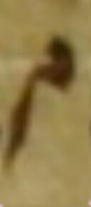 | Virga | 3r | Dominus dabit, 1st line, teRRA | neume.virga | 1 | `<neume>` &nbsp;&nbsp;&nbsp;&nbsp;`<nc tilt="ne"/>` `</neume>` | | E-SAu Ms. 2637 (ACm) |
| https://pemdatabase.eu/iipsrv/iipsrv.fcgi?IIIF=images/1d335927-f461-4bdb-a6e5-069a24a9d3f1/V9ZD2CnI8759.tiff/1936,541,37,52/128,/0/default.jpg | 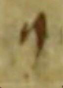 | Cephalicus | 3r | Dominus dabit, 1st line, ET | neume.cephalicus | 1 | `<neume>` &nbsp;&nbsp;&nbsp;&nbsp;`<nc curve="c" type="cephalicus">` &nbsp;&nbsp;&nbsp;&nbsp;&nbsp;&nbsp;&nbsp;&nbsp;`<liquescent/>` &nbsp;&nbsp;&nbsp;&nbsp;`</nc>` `</neume>` | | E-SAu Ms. 2637 (ACm) |
| https://pemdatabase.eu/iipsrv/iipsrv.fcgi?IIIF=images/1d335927-f461-4bdb-a6e5-069a24a9d3f1/oI017Xju8794.tiff/1847,720,60,65/128,/0/default.jpg | 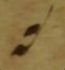 | Epiphonus | 20v | Vidimus stellam, 1st line, STELlam | neume.epiphonus | 1 | `<neume>` &nbsp;&nbsp;&nbsp;&nbsp;`<nc curve="a" type="epiphonus">` &nbsp;&nbsp;&nbsp;&nbsp;&nbsp;&nbsp;&nbsp;&nbsp;`<liquescent/>` &nbsp;&nbsp;&nbsp;&nbsp;`</nc>` `</neume>` | | E-SAu Ms. 2637 (ACm) |
| https://pemdatabase.eu/iipsrv/iipsrv.fcgi?IIIF=images/1d335927-f461-4bdb-a6e5-069a24a9d3f1/s0N4NSFQ8805.tiff/1734,2341,24,28/128,/0/default.jpg | 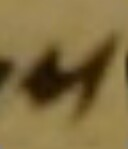 | Oriscus | 26r | Illumina, 3rd line, confunDAR | neume.oriscus | 1 | `<neume>` &nbsp;&nbsp;&nbsp;&nbsp;`<nc>` &nbsp;&nbsp;&nbsp;&nbsp;&nbsp;&nbsp;&nbsp;&nbsp;`<oriscus/>` &nbsp;&nbsp;&nbsp;&nbsp;`</nc>` `</neume>` | | E-SAu Ms. 2637 (ACm) |
| https://pemdatabase.eu/iipsrv/iipsrv.fcgi?IIIF=images/1d335927-f461-4bdb-a6e5-069a24a9d3f1/RQKyrNTU8790.tiff/1325,2047,45,53/128,/0/default.jpg | 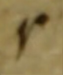 | Quilisma | 18v | Tolle puerum, 1st line, TErram | neume.quilisma | 1 | `<neume>` &nbsp;&nbsp;&nbsp;&nbsp;`<nc>` &nbsp;&nbsp;&nbsp;&nbsp;&nbsp;&nbsp;&nbsp;&nbsp;`<quilisma/>` &nbsp;&nbsp;&nbsp;&nbsp;`</nc>` `</neume>` | | E-SAu Ms. 2637 (ACm) |
| https://pemdatabase.eu/iipsrv/iipsrv.fcgi?IIIF=images/1d335927-f461-4bdb-a6e5-069a24a9d3f1/h_zRaSsE8826.tiff/567,2231,45,56/128,/0/default.jpg | 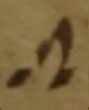 | Torculus11 | 37r | Scapulis, 2nd line, scuTO | neume.torculus11 | [1, 1, 1] | `<neume>` &nbsp;&nbsp;&nbsp;&nbsp;`<nc/>` &nbsp;&nbsp;&nbsp;&nbsp;`<nc intm="1S"/>` &nbsp;&nbsp;&nbsp;&nbsp;`<nc intm="-1S"/>` `</neume>` | | E-SAu Ms. 2637 (ACm) |
| https://pemdatabase.eu/iipsrv/iipsrv.fcgi?IIIF=images/1d335927-f461-4bdb-a6e5-069a24a9d3f1/V9ZD2CnI8759.tiff/1349,534,66,73/128,/0/default.jpg | 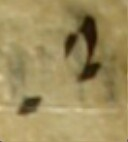  | Torculus21 | 3r | Dominus dabit, 1st line, doMInus | neume.torculus21 | [1, 1, 1] | `<neume>` &nbsp;&nbsp;&nbsp;&nbsp;`<nc/>` &nbsp;&nbsp;&nbsp;&nbsp;`<nc intm="2S"/>` &nbsp;&nbsp;&nbsp;&nbsp;`<nc intm="-1S"/>` `</neume>` | | E-SAu Ms. 2637 (ACm) |
| https://pemdatabase.eu/iipsrv/iipsrv.fcgi?IIIF=images/1d335927-f461-4bdb-a6e5-069a24a9d3f1/jyc11xgr8762.tiff/773,2062,55,75/128,/0/default.jpg | 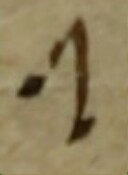  | Torculus12 | 4v | Jerusalem surge, 1st line, JErusalem | neume.torculus12 | [1, 1, 1] | `<neume>` &nbsp;&nbsp;&nbsp;&nbsp;`<nc/>` &nbsp;&nbsp;&nbsp;&nbsp;`<nc intm="1S"/>` &nbsp;&nbsp;&nbsp;&nbsp;`<nc intm="-2S"/>` `</neume>` | | E-SAu Ms. 2637 (ACm) |
| https://pemdatabase.eu/iipsrv/iipsrv.fcgi?IIIF=images/1d335927-f461-4bdb-a6e5-069a24a9d3f1/jjx1scZx8779.tiff/971,2032,60,81/128,/0/default.jpg | 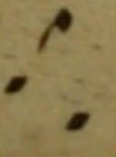  | Torculus23 | 13r | In splendoribus, 1st line, liduFErum | neume.torculus23 | [1, 1, 1] | `<neume>` &nbsp;&nbsp;&nbsp;&nbsp;`<nc/>` &nbsp;&nbsp;&nbsp;&nbsp;`<nc intm="2S"/>` &nbsp;&nbsp;&nbsp;&nbsp;`<nc intm="-3S"/>` `</neume>` | | E-SAu Ms. 2637 (ACm) |
| https://pemdatabase.eu/iipsrv/iipsrv.fcgi?IIIF=images/1d335927-f461-4bdb-a6e5-069a24a9d3f1/RQKyrNTU8790.tiff/670,2095,28,57/128,/0/default.jpg | 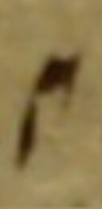  | Liquescent virga | 18v | Tolle puerum, 1st line, TOLle | neume.virgaliq | 1 | `<neume>` &nbsp;&nbsp;&nbsp;&nbsp;`<nc curve="c" tilt="ne">` &nbsp;&nbsp;&nbsp;&nbsp;&nbsp;&nbsp;&nbsp;&nbsp;`<liquescent/>` &nbsp;&nbsp;&nbsp;&nbsp;`</nc>` `</neume>` | | E-SAu Ms. 2637 (ACm) |
