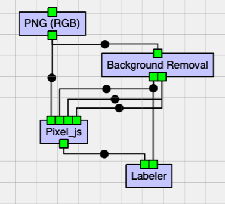
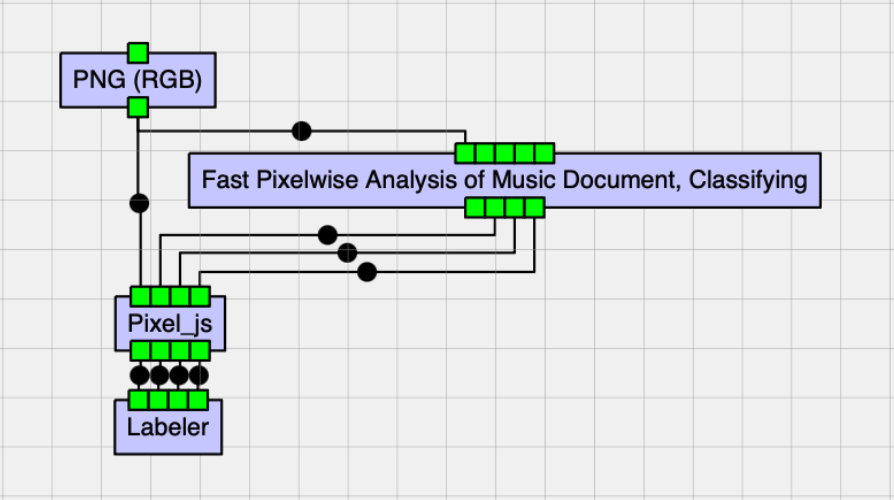
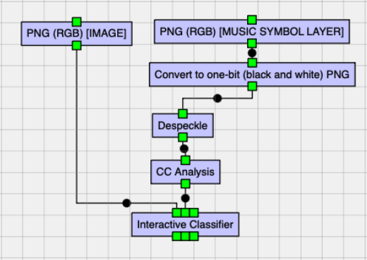
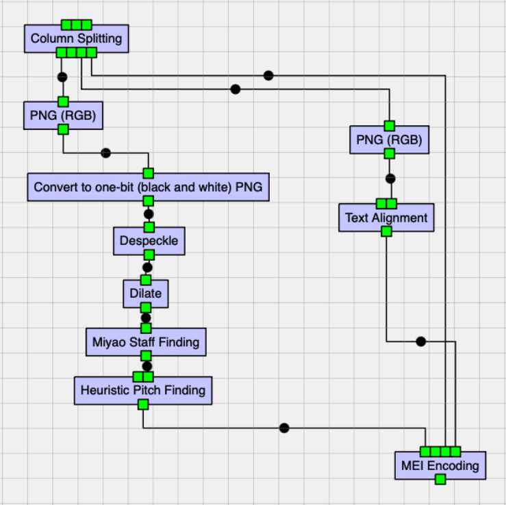
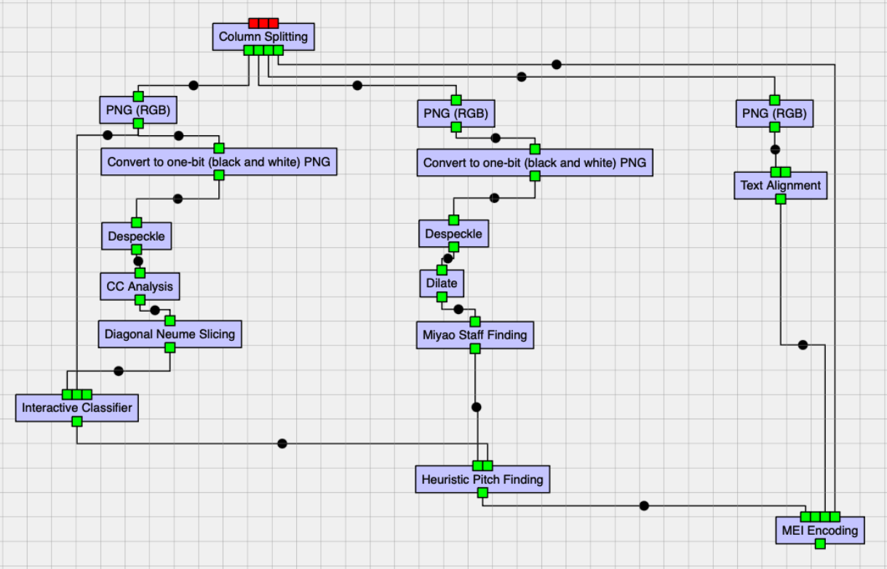

# Workflows

## BGRemoval Workflow

**Summary:** This workflow allows to save time in the Pixel classification part of the OMR

**Workflow file:** [BGRemoval.json](./BGRemoval.json)

It uses the `Background Removal` job to obtain a foreground layer—which would include all the foreground pixels belonging to music symbols, staff lines, text, images, etc.—and then use Pixel to cut and paste the elements of this layer into the appropriate music symbols, staff lines, and text layers.

The foreground layer obtained by the `Background Removal` job is given by its output port `RGBA PNG image`. This output port can be connected to one of the layer (optional) input ports in Pixel (e.g.,music symbol layer). 
The remaining input layers of Pixel (e.g., staff lines and text) should be connected to the (optional) `Empty Layer` output port from the `Background Removal` job. Then one can use the cut & paste tools from Pixel to move the pixels from the foreground layer into the appropriate layer (e.g., cut them from the music symbol layer to paste them in the appropriate staff lines or text layers).

**Important note:** We always use the `PNG (RGB)` job to process the image at the very beginning.

### Screenshot of workflow

### Screenshot of workflow with annotated for ports

---

## AutomatPixelClassif Workflow

**Summary:** This workflow automatically performs document analysis (pixel classification of the image into the various layers of music symbols, staff lines, text, and background) and then allows the user to fix the results in Pixel. The results can be saved with a label of the folio being processed (this is achieved by using the `labeler` job and set its settings to the label one wants to use).

**Workflow file:** [AutomatPixelClassif.json](./AutomatPixelClassif.json)

### Screenshot of workflow

---

## IC Workflow

**Summary:** This workflow receives an image and its music symbol layer to be used to classify the music symbosl in the image using the `Interactive Classifier` (IC) job. This workflow in particular was used for generating the training data for Aquitanian music symbols (as one sees that the `Interactive Classifier` job is directly preceded by the `CC Analysis` job, and there is no `Diagonal Neume Splitting` job in between, which we usually use for square notation to divide complex neumes into their neume components and have less glyph classes).

The IC job here has three outputs: 
- *training data*, to be used for the automatic classification of the music symbols of other images in the future
- *classified glyphs*, to be further processed later (with the `heuristic pitch finding` and `mei encoding` jobs)
- and the *class names*, to be used later for the MEI Mapping CSV file so that these classes of glyphs are converted into the correct MEI encoding

**Workflow file:** [IC.json](./IC.json)

### Screenshot of workflow

---

## Classified Glyphs to MEI Encoding Workflow

**Summary:** This workflow allows to save time in the Pixel classification part of the OMR

**Workflow file:** [Classified_Glyphs_to_MEI_Encoding.json](./Classified_Glyphs_to_MEI_Encoding.json)

### Screenshot of workflow

---

## End2End Workflow

**Summary:** This workflow allows to save time in the Pixel classification part of the OMR

**Workflow file:** [End2End.json](./End2End.json)

### Screenshot of workflow

